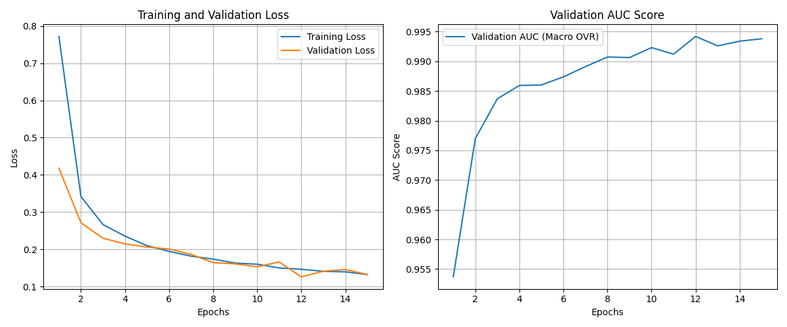
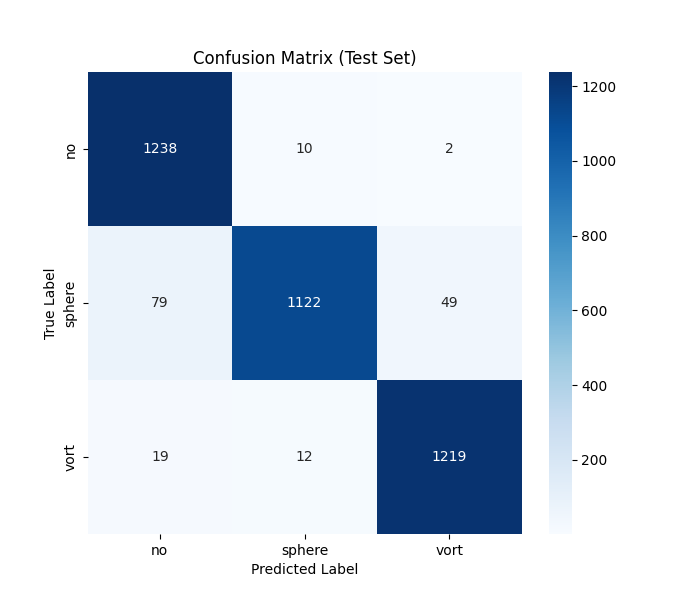
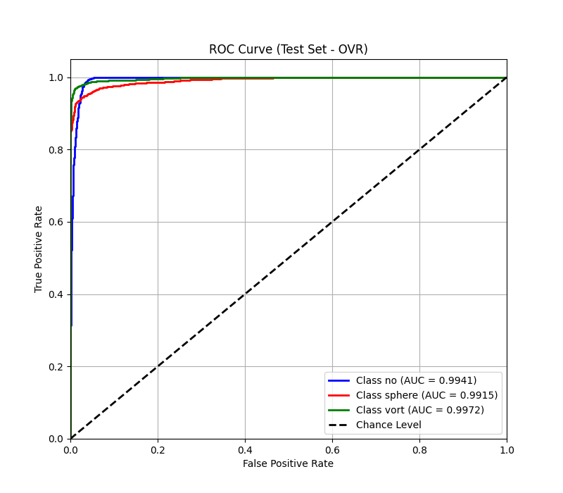

# Multi-Class Gravitational Lens Substructure Classification

## 1. Overview

In this project, we developed a deep learning model using PyTorch to classify gravitational lensing images based on the type of substructure they exhibit. The task was to distinguish between three categories:

- **No Substructure (`no`):** Images showing strong lensing without noticeable substructure.
- **Sphere Substructure (`sphere`):** Images with spherical substructures, similar to cold dark matter subhalos.
- **Vortex Substructure (`vort`):** Images exhibiting vortex-like patterns that might hint at alternative physics (e.g., axion or superfluid behavior).

Our goal was to achieve high accuracy and robust performance using a state-of-the-art model and effective data processing techniques.

## 2. The Dataset

- **Source:** Provided as `.npy` files.
- **Image Format:** Each file contains a single-channel (grayscale) image of shape `(1, 150, 150)`.
- **Directory Structure:**
  - `dataset/train/`: 10,000 images per class.
  - `dataset/val/`: 2,500 images per class.
- **Preprocessing:**  
  Initially, each image was Z-normalized (adjusting each image to have zero mean and unit variance). Later, to align with standard practices for ImageNet pretrained models, we adopted normalization using ImageNet’s mean and standard deviation.
- **Data Splitting:**  
  To follow best practices, we derived a test set from the original validation data. This resulted in a split of approximately 80% for training, 10% for validation, and 10% for testing.

## 3. Our Approach

### Model Selection: ConvNeXt V2 Tiny

We chose the `facebook/convnextv2-tiny-1k-224` model from the Hugging Face Transformers library for several reasons:

- **Modern Architecture:**  
  ConvNeXt V2 incorporates recent design innovations that improve performance on vision tasks.
- **Transfer Learning:**  
  With pretrained weights from ImageNet, the model starts with a strong foundation, enabling faster convergence and better performance than training from scratch.
- **Efficiency:**  
  The “Tiny” variant strikes a good balance between computational efficiency and predictive power.
- **Adaptability:**  
  We replaced the original classification head (designed for 1000 classes) with a new one that outputs three class scores, using the `ignore_mismatched_sizes=True` flag to handle the change.

*Alternatives like simpler CNNs or Vision Transformers were considered, but ConvNeXt V2 provided the best mix of performance and sufficiently large for better accuracy when good amount of training data is concerned.*

### Data Preprocessing and Augmentation

1. **Data Loading:**  
   We built a custom PyTorch Dataset to load the `.npy` files.
2. **Channel Handling:**  
   Since our images are grayscale, we duplicated the single channel to create a three-channel (RGB) input required by the pretrained model.
3. **Resizing:**  
   Images were resized from 150×150 to 224×224 to match the expected input size of ConvNeXt V2.
4. **Normalization:**  
   We applied ImageNet’s mean `[0.485, 0.456, 0.406]` and standard deviation `[0.229, 0.224, 0.225]` for normalization, ensuring consistency with the model’s pretraining.
5. **Augmentation (Training Only):**  
   To increase robustness and reduce overfitting, we employed:
   - Random horizontal and vertical flips.
   - Random affine transformations (rotations, scaling, and translations).

### Training Strategy

- **Loss Function:**  
  We used CrossEntropyLoss, ideal for multi-class problems.
- **Optimizer:**  
  AdamW was selected for its effective handling of weight decay, with a small learning rate (e.g., 5e-5) suitable for fine-tuning.
- **Learning Rate Scheduler:**  
  A ReduceLROnPlateau scheduler was implemented to lower the learning rate if the validation loss plateaued.
- **Epochs & Checkpointing:**  
  The model was trained for 15 epochs, with the best checkpoint (based on validation AUC) saved for final evaluation.

## 4. Evaluation Metrics

We assessed our model’s performance on the derived test set using several metrics:

- **ROC Curve & AUC:**  
  ROC curves were plotted for each class using a One-vs-Rest approach, and both macro-averaged OVR and OVO AUC scores were computed.
- **Accuracy:**  
  Overall accuracy was measured as the percentage of correctly classified images.
- **Classification Report:**  
  Detailed precision, recall, and F1-scores for each class were generated.
- **Confusion Matrix:**  
  This visualization helped us identify where misclassifications occurred.

## 5. Results

The ConvNeXt V2 Tiny model performed exceptionally well:

- **Test ROC AUC (OVR Macro):** 0.9943
- **Test Accuracy:** 0.9544

The per-class metrics confirmed robust performance across all three categories, with only minimal misclassifications noted in the confusion matrix. Visualizations such as training history, ROC curves, and the confusion matrix further validated the model's stability and effectiveness.

## Model Weights

You can download the pre-trained model weights for Task 1 from the link below:

[Download Task1 Model](https://drive.google.com/file/d/1uaLVsV-xLv7fDwJmlwU8eBCe0f0WILwV/view?usp=sharing)

### Visualizations

#### Training History

#### Confusion Matrix

#### ROC Curve

Visualizations such as these further validate the model's stability and effectiveness.

## 6. Opportunities for Improvement

While our results are strong, there are several avenues for further exploration:

- **Hyperparameter Tuning:**  
  Fine-tuning learning rates, weight decay, and batch sizes might yield incremental improvements.
- **Advanced Augmentation Techniques:**  
  Incorporating methods like Mixup or CutMix could further enhance robustness.
- **Experimenting with Model Sizes:**  
  Testing larger ConvNeXt V2 variants (e.g., base or large) may improve performance, though with increased resource demands.
- **Alternative Architectures:**  
  Exploring other backbones like ResNet, EfficientNet, or Vision Transformers could provide valuable comparisons.
- **Extended Training:**  
  More epochs with careful validation might help achieve even better convergence.

## 7. Dependencies

To run this project, ensure the following libraries are installed:

- PyTorch
- Transformers (Hugging Face)
- NumPy
- Scikit-learn
- Matplotlib
- Seaborn
- tqdm
- PIL
