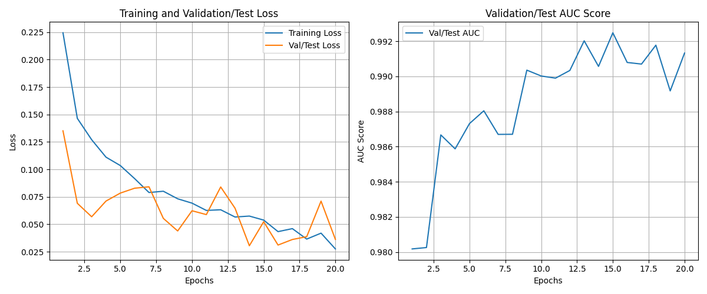

# Task 2: Gravitational Lens Finding (Binary Classification)

## 1. Overview

In this task, our goal was to build a binary classifier that can distinguish between images containing strong gravitational lenses and those without. Given the inherent class imbalance (with non-lens images vastly outnumbering lens images), we designed our approach to pay extra attention to the rare lens class while still maintaining overall high performance.

## 2. Dataset

- **Source:** The dataset is provided as `.npy` files.
- **Image Format:** Each image is represented as a 3-channel array with dimensions `(3, 64, 64)`, corresponding to different observational filters.
- **Directory Structure:**
  - Training:
    - `train_lenses/`: Images of lensed objects.
    - `train_nonlenses/`: Images of non-lensed objects.
  - Testing:
    - `test_lenses/`: Images of lensed objects.
    - `test_nonlenses/`: Images of non-lensed objects.
- **Class Imbalance:**  
  - **Train:** Approximately 1 lens for every 16 non-lens images.
  - **Test:** Approximately 1 lens for every 100 non-lens images.

## 3. Approach and Strategy

### Model Selection

We used the `facebook/convnextv2-tiny-1k-224` model as our backbone. This choice was driven by:
- **Pretrained Strength:** Leveraging ImageNet pretraining gives the model a robust feature extractor right from the start.
- **Efficiency and Flexibility:** The Tiny variant offers a good balance between computational efficiency and performance.
- **Seamless Adaptation:** The model easily adapts to our 3-channel input and can be fine-tuned by replacing the final classification layer with a binary head.

### Data Preprocessing and Augmentation

- **Loading and Resizing:**  
  The images (originally 64×64) are loaded from `.npy` files and resized to 224×224 to match the model’s expected input dimensions.
- **Normalization:**  
  Standard ImageNet mean and standard deviation values are applied, ensuring compatibility with the pretrained weights.
- **Augmentation:**  
  To help the model generalize better—especially for the underrepresented lens class—we applied:
  - Random horizontal and vertical flips.
  - Random rotations (up to 45°).

### Handling Class Imbalance

Due to the skewed distribution:
- **Weighted Loss:**  
  We computed class weights using the training data and applied them in the `nn.CrossEntropyLoss`. This increases the penalty for misclassifying lens images.
- **Evaluation Focus:**  
  Instead of relying solely on accuracy, we focused on ROC AUC, Precision, Recall, and the Confusion Matrix to better understand model performance on the rare lens class.

### Training Strategy

- **Optimizer:**  
  AdamW was used with a fine-tuning learning rate of 3e-5.
- **Learning Rate Scheduler:**  
  A `ReduceLROnPlateau` scheduler monitored the validation AUC and reduced the learning rate when improvements stalled.
- **Epochs and Checkpointing:**  
  The model was trained for 20 epochs, and the best checkpoint was saved based on the highest validation (test set) AUC.

## 4. Evaluation Metrics

We evaluated our model on the test set using:
- **ROC Curve & AUC:**  
  To assess the model’s discriminative ability across different thresholds.
- **Accuracy:**  
  Reported for context, though less informative given the class imbalance.
- **Classification Report:**  
  Detailed metrics (Precision, Recall, F1-score) for each class, with a special focus on the lens (minority) class.
- **Confusion Matrix:**  
  Visualizes True Positives, False Positives, True Negatives, and False Negatives, highlighting the model’s performance on rare lenses.

## 5. Results

Our fine-tuned ConvNeXt V2 Tiny model achieved strong results despite the severe class imbalance:

- **Final Test ROC AUC:** 0.9925
- **Final Test Accuracy:** 0.9810

**Classification Report Highlights:**

| Class        | Precision | Recall | F1-score | Support |
|--------------|-----------|--------|----------|---------|
| Non-Lens (0) | 1.00      | 0.98   | 0.99     | 19,455  |
| Lens (1)     | 0.33      | 0.92   | 0.49     | 195     |
| **Macro Avg**| **0.67**  | **0.95**| **0.74** | 19,650  |

- The model achieved a high **Recall (0.92)** for lenses, ensuring that most actual lenses are detected.
- Although the **Precision for lenses (0.33)** is lower due to the high number of non-lens examples, the overall discriminative ability is confirmed by the excellent AUC.

## Model Weights

You can download the pre-trained model weights for Task 2 from the link below:

[Download Task2 Model](https://drive.google.com/file/d/14U7lbo39qMqPoPSLAyHy_jGiEHa_3BVN/view?usp=sharing)

### Visualizations

#### Training History

#### Confusion Matrix

#### ROC Curve

These plots further illustrate the model's training progress and final performance, highlighting its strong ability to differentiate between lensed and non-lensed images.

## 6. Scope for Improvement

While the results are promising, there are several areas for potential enhancement:
- **Validation Split:**  
  Splitting the training data further into a dedicated validation set could provide a more robust evaluation during training.
- **Threshold Tuning:**  
  Adjusting the decision threshold might improve precision for the lens class.
- **Advanced Techniques:**  
  Exploring techniques such as focal loss, weighted sampling, or ensemble methods could further address the class imbalance.
- **Hyperparameter Optimization:**  
  Further tuning of learning rates, augmentation strength, and batch sizes might yield incremental improvements.

## 7. Dependencies

To run this project, ensure you have the following libraries installed:
- PyTorch
- Transformers (Hugging Face)
- NumPy
- Scikit-learn
- Matplotlib
- Seaborn
- tqdm
- Glob
- Collections
