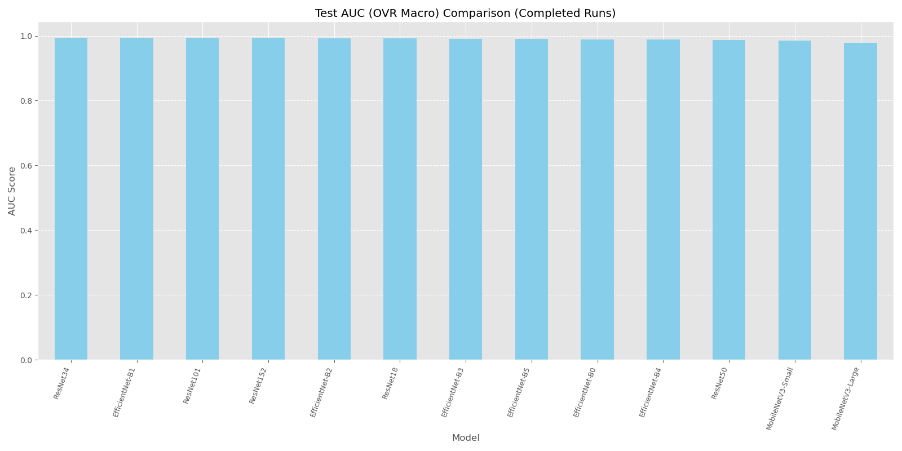
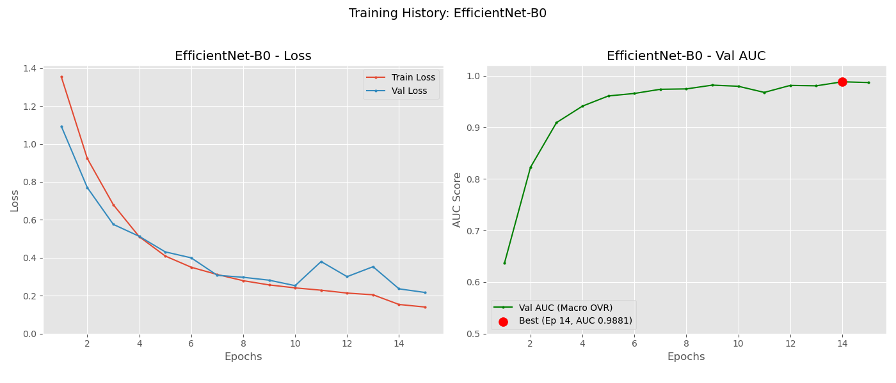

# DeepLense - Gravitational Lensing Classification (Common Test I)

This project implements a comprehensive model evaluation framework for classifying gravitational lensing images using various deep learning architectures.

## Task Description

**Common Test I: Multi-Class Classification**

The task involves building deep learning models for classifying strong gravitational lensing images into three categories using PyTorch. Multiple architectures were evaluated to determine the optimal approach for this specific classification problem.

- `no`: Strong lensing images with no substructure
- `sphere`: Strong lensing images with subhalo substructure
- `vort`: Strong lensing images with vortex substructure

## Directory Structure

```
task1/
├── config.py                  # Configuration settings
├── lens_utils.py              # Utility functions for dataset handling and model evaluation
├── run_single_model.py        # Script to train a single model
├── main_controller.py         # Script to run all models sequentially
├── compare_results.py         # Script to compare and visualize model performances
├── generate_history_plots.py  # Script to generate training history plots
├── model_comparison_task1_results_final.csv  # Final comparison results
├── dataset/                   # Original dataset directory
│   ├── train/
│   └── val/
├── dataset_split/             # Split dataset with train/val/test
├── model_weights_task1_comparison/     # Saved model weights
└── model_results_task1_comparison/     # Individual model results (JSON)
```

## Requirements

The project requires the following dependencies:

- Python 3.6+
- PyTorch and torchvision
- NumPy
- Matplotlib
- Pandas
- Seaborn
- scikit-learn
- tqdm
- Hugging Face Transformers (optional for HF models)
- timm (optional for additional model architectures)
- tabulate (optional for better table formatting)

## Dataset Description

The dataset consists of simulated gravitational lensing images stored as NumPy arrays (`.npy` files). All images have been normalized using min-max normalization, though additional normalization and data augmentation techniques were applied during training to improve model performance.

The dataset is organized as follows:
- `dataset/train/` - Original training set
- `dataset/val/` - Original validation set
- `dataset_split/` - The code automatically splits the original validation set into new validation and test sets

## Running the Pipeline

### 1. Extract the dataset

If the dataset is compressed, extract it:

```bash
unzip dataset.zip -d dataset
```

### 2. Train all models

Run the main controller script to train all models defined in `config.py`:

```bash
python main_controller.py
```

This will sequentially train and evaluate each model, saving results to the `model_results_task1_comparison` directory.

### 3. Compare model performance

After training, run the comparison script to generate visualizations and identify the best model:

```bash
python compare_results.py
```

### 4. Generate missing plots (if needed)

If any training history plots are missing:

```bash
python generate_history_plots.py
```

## Training a Single Model

To train a specific model individually:

```bash
python run_single_model.py --model_desc "Model Name" --model_identifier "model_identifier" [--batch_size BATCH_SIZE] [--epochs EPOCHS]
```

Example:

```bash
python run_single_model.py --model_desc "ResNet18" --model_identifier "resnet18" --batch_size 32 --epochs 20
```

## Evaluation Metrics

Models were evaluated using:
- **ROC curve** (Receiver Operating Characteristic curve)
- **AUC score** (Area Under the ROC Curve)
- Additional metrics: accuracy, confusion matrices, and training/validation loss curves

## Training Environment

The training was performed on multiple hardware configurations:
- Most models (ResNet18, ResNet34, ResNet50, ResNet101, ResNet152, EfficientNet-B0, B1, B2, B3) were trained on a Ryzen 5900X CPU-only machine
- MobileNetV3 (Small and Large), EfficientNet-B4, and EfficientNet-B5 were trained on an NVIDIA RTX 4000 Ada GPU

**Note:** Due to the different hardware used for training, the training time comparisons and AUC vs. time plots should not be taken as direct comparisons. The GPU-trained models naturally completed training faster than CPU-trained models.

**Status:** Training for ConvNextV2 and other Vision Transformer models is still in progress and will be added to the comparison when completed.

## Model Architectures

The project evaluates multiple model architectures including:

- ResNet (18, 34, 50, 101, 152) - Trained on CPU
- EfficientNet (B0, B1, B2, B3) - Trained on CPU
- EfficientNet (B4, B5) - Trained on GPU
- MobileNetV3 (Small, Large) - Trained on GPU
- ConvNextV2 and other Vision Transformer models (training in progress)

## Model Results Gallery

### Comparison Plots

<table>
<tr>
<td></td>
<td></td>
</tr>
<tr>
<td></td>
<td></td>
</tr>
</table>

### ResNet Family

<table>
<tr>
<td><b>ResNet18</b></td>
<td><b>ResNet34</b></td>
<td><b>ResNet50</b></td>
</tr>
<tr>
<td></td>
<td></td>
<td></td>
</tr>
<tr>
<td></td>
<td></td>
<td></td>
</tr>
<tr>
<td></td>
<td></td>
<td></td>
</tr>
<tr>
<td><b>ResNet101</b></td>
<td><b>ResNet152</b></td>
<td></td>
</tr>
<tr>
<td></td>
<td></td>
<td></td>
</tr>
<tr>
<td></td>
<td></td>
<td></td>
</tr>
<tr>
<td></td>
<td></td>
<td></td>
</tr>
</table>

### EfficientNet Family

<table>
<tr>
<td><b>EfficientNet-B0</b></td>
<td><b>EfficientNet-B1</b></td>
<td><b>EfficientNet-B2</b></td>
</tr>
<tr>
<td></td>
<td></td>
<td></td>
</tr>
<tr>
<td></td>
<td></td>
<td></td>
</tr>
<tr>
<td></td>
<td></td>
<td></td>
</tr>
<tr>
<td><b>EfficientNet-B3</b></td>
<td><b>EfficientNet-B4</b> (GPU)</td>
<td><b>EfficientNet-B5</b> (GPU)</td>
</tr>
<tr>
<td></td>
<td></td>
<td></td>
</tr>
<tr>
<td></td>
<td></td>
<td></td>
</tr>
<tr>
<td></td>
<td></td>
<td></td>
</tr>
</table>

### MobileNetV3 Family (GPU)

<table>
<tr>
<td><b>MobileNetV3-Small</b></td>
<td><b>MobileNetV3-Large</b></td>
</tr>
<tr>
<td></td>
<td></td>
</tr>
<tr>
<td></td>
<td></td>
</tr>
<tr>
<td></td>
<td></td>
</tr>
</table>

## Results

The best performing model based on Test AUC (OVR Macro) is identified in the comparison report and visualized in various plots:

- `comparison_plot_test_auc.png`: Bar chart of Test AUC scores
- `comparison_plot_test_accuracy.png`: Bar chart of Test Accuracy scores
- `comparison_plot_training_time.png`: Bar chart of Training Time
- `comparison_plot_auc_vs_time.png`: Scatter plot of AUC vs. Training Time

Individual model results include:
- `confusion_matrix_*.png`: Confusion matrices for each model
- `roc_curve_*.png`: ROC curves for each model
- `training_history_*.png`: Training history plots

The final results are also saved in CSV format: `model_comparison_task1_results_final.csv`

## Key Findings

According to the comparison results, ResNet34 achieved the highest Test AUC (OVR Macro) of 0.9942, closely followed by EfficientNet-B1 with 0.9937. While MobileNetV3 models were the fastest to train (due to both model size and GPU acceleration), they produced slightly lower AUC scores.

**Hardware Note:** Since different models were trained on different hardware (CPU vs. GPU), direct training time comparisons should be interpreted with caution. The AUC vs training time plot should be viewed as a general reference rather than a precise comparison.

## Important Visualizations

The project generates several types of visualizations that provide insights into model performance:

### Model Comparison Plots

These plots provide a comprehensive comparison of all models:

1. **Test AUC Comparison**
   
   
   
   This bar chart ranks models by their Test AUC (OVR Macro) scores, helping identify the best performing models.

2. **Test Accuracy Comparison**
   
   
   
   This visualization shows the classification accuracy of each model on the test set.

3. **Training Time Comparison**
   
   
   
   This plot compares the training time required for each model, which is essential for evaluating computational efficiency.

4. **AUC vs Training Time**
   
   
   
   This scatter plot shows the trade-off between model performance (AUC) and computational cost (training time).

### Individual Model Analysis

For each model, the following visualizations are generated:

1. **Confusion Matrix**
   
   Example: 
   
   The confusion matrix shows the distribution of predicted vs. actual classes, highlighting where the model makes correct classifications and where it makes mistakes.

2. **ROC Curves**
   
   Example: 
   
   The ROC (Receiver Operating Characteristic) curves display the performance of the model for each class and overall, with the Area Under the Curve (AUC) being a key metric for classification quality.

3. **Training History**
   
   Example: 
   
   These plots show the progression of training loss, validation loss, and validation AUC over epochs, which is useful for understanding the training dynamics and identifying potential overfitting.

## Customization

The project can be customized by modifying `config.py`, which contains settings for:

- Batch size and learning rate
- Number of epochs
- Data splitting ratios
- Models to run
- Directory paths

## Acknowledgements

This project is part of the DeepLense initiative for applying deep learning techniques to gravitational lensing analysis for Common Test I: Multi-Class Classification.